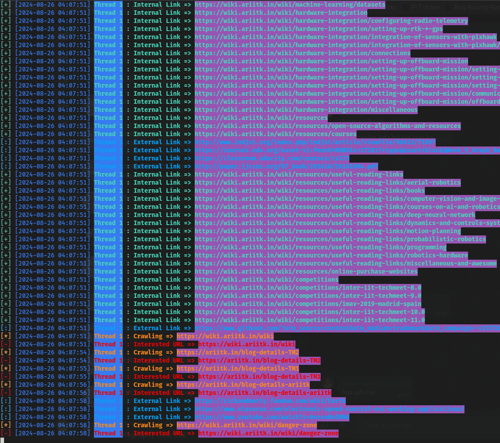
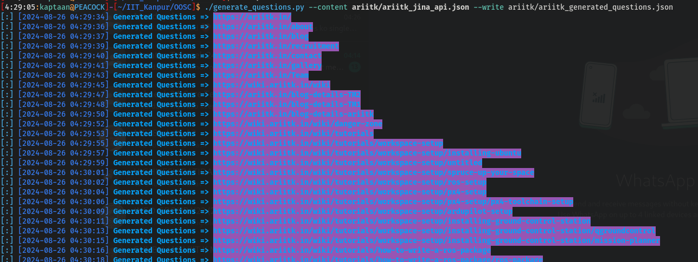

# Overlay : Gen AI
## Objective
To develop a system that automates the process of generating relevant questions from website content.
## Solution
Language Used = Python3 <br />
Modules/Packages used:
* requests
* json
* multiprocessing
* urllib
* bs4
* datetime
* optparse
* colorama
* time
* sklearn
* google.generativeai
<!-- -->
Install the dependencies:
```bash
pip install -r requirements.txt
```
Run the following programs in Order to achive the final JSON File
### crawler.py
Crawls the provided URL.
* '-u', "--url" : URLs to start Crawling from (seperated by ',') or Path of File containing list of URLs
* '-s', "--session-id" : Session ID (Cookie) for the Request Header (Optional)
* '-w', "--write" : Name of the File for the data to be dumped (default=current data and time)
* '-e', "--external" : Crawl on External URLs (True/False, default=False)
* '-T', "--timeout" : Request Timeout
* '-i', "--ignore-extensions" : Extensions to Ignore (seperated by ',')
<!-- -->
For Example:
```bash
python3 crawler.py --url https://ariitk.in --write ariitk_crawler.json
```

### json_to_txt.py
Converts the JSON File obtained from Crawler to List of URLs.<br />
Usage:
```bash
python3 json_to_txt.py json_file_from_crawler urls_file_to_be_saved
```
For Example:
```bash
python3 json_to_txt.py ariitk_crawler.json ariitk_urls.txt
```
### jina_ai.py
Gets the Content from each URL using API Calls of [Jina AI](https://jina.ai/) and saves it in a JSON File
* '-u', "--url" : URLs (Seperated by ',' or File Name)
* '-w', "--write" : Name of the File for the data to be dumped (default=current data and time)
<!-- -->
For Example:
```bash
python3 jina_ai.py --url ariitk_urls.txt --write ariitk_content.json
```
### Note
We have to Paste our API Key of [Jina AI](https://jina.ai/) at Line 39
### generate_questions.py
Generates questions from the Content Received from the URLs using Google Generative AI (Gemini-1.5) and saves it in a JSON File
* '-c', "--content" : JSON File of URL Content
* '-w', "--write" : Name of the File for the data to be dumped (default=current data and time)
<!-- -->
For Example:
```bash
python3 generate_questions.py --content ariitk_content.json --write ariitk_questions.json
```

### Note
We have to Paste our API Key of [Google Gemini AI](https://aistudio.google.com/app/apikey) at Line 40
### similar_links.py
Generates the Final JSON file containing questions and relevant Links using sklearn Python Package
* '-c', "--content" : Content JSON File
* '-q', "--questions" : Question JSON File
* '-w', "--write" : Name of the File for the data to be dumped (default=current data and time)
<!-- -->
```bash
python3 similar_links.py --content ariitk_content.json --questions ariitk_questions.json --write ariitk_final_file.json
```
## Website Used
We used [Aerial Robotics, IIT Kanpur](https://ariitk.in) and all of the data files are stored in *ariitk* folder:
* ariitk/ariitk.json : Data Collected by Crawler
* ariitk/ariitk_urls.txt : List of URLs
* ariitk/ariitk_jina_api.txt : Content of URLs
* ariitk/ariitk_generated_questions.json : Generated Questions from each URL
* ariitk/ariitk_final_data.json : Containing Questions and Relevant Links for each URL
### Note
We did a Similar Test on the [OOSC Website](https://oosc-next.vercel.app/) and its files are stored in *test_data/oosc* folder:
* test_data/oosc/crawler_data.json : Data Collected by Crawler
* test_data/oosc/urls.txt : List of URLs
* test_data/oosc/jina_api.txt : Content of URLs
* test_data/oosc/generated_questions.json : Generated Questions from each URL
* test_data/oosc/oosc_final_data.json : Containing Questions and Relevant Links for each URL
## Automation
**automate.sh** automates the running of the 5 Python Programs and saves the Final JSON File<br />
Usage
```bash
./automate.sh website_url
```
For Example:
```bash
./automate.sh https://ariitk.in
```